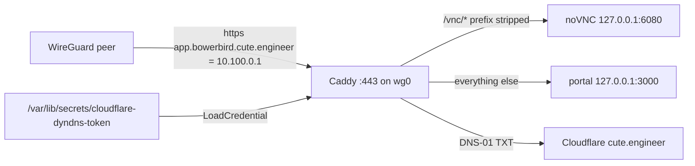

# portal-https

Jimbo's share of [kranners/bowerbird#37](https://github.com/kranners/bowerbird/issues/37), members phase 0.
The plan behind it is the [members plan](https://claude.ai/artifact/6hP7NKKVxcNJUh8eFA5QqA).

## Motivations and Context

- Members need a secure context: Better Auth's cookies, passkeys later and the Clipboard API all want HTTPS, and spike serves plain http on the LAN today (D4).
- The portal gets one name, `app.bowerbird.cute.engineer`, reached by everyone over WireGuard at `10.100.0.1`, Aaron at home included, so there is one address to care about.
- Cloudflare holds `cute.engineer`'s DNS, and the cloudflare-dyndns token spike already holds can read the zone and edits `spike.cute.engineer`, so DNS-01 needs no new secret.
- The token file holds the bare token, which systemd cannot load as an `EnvironmentFile`, so Caddy reads it as a systemd credential through its `{file.*}` placeholder, which `caddy-dns/cloudflare` resolves with `caddy.NewReplacer()`.
- The portal container runs with `network_mode: host`, so the NixOS firewall governs port 3000 and closing it there closes it.
- The portal's `remoteViewFor` swaps only the hostname, so with the remote view under the name it returns the same URL; no change is needed there.
- Step 3's `forward_auth` needs step 2's `GET /api/auth/ok`, and Caddy denying every `/vnc/` request until that route exists would break the remote view, so it is a later branch.
- No friend has a WireGuard key yet and phase 0 lands while Aaron is the only member, so no friend peer is added here.

## Outcomes

- Caddy on spike, built with `caddy-dns/cloudflare`, serves `app.bowerbird.cute.engineer` with a Let's Encrypt certificate by DNS-01.
- `/vnc/*` goes to noVNC on `6080` with the prefix stripped, everything else to the portal on `3000`.
- `REMOTE_VIEW_URL` is `https://app.bowerbird.cute.engineer/vnc/vnc.html?autoconnect=1&resize=scale`.
  noVNC 1.7.0 defaults `host` to empty and `path` to `websockify`, resolved with `new URL(path, location.href)`, so from `/vnc/vnc.html` it already reaches `/vnc/websockify`; the issue's `path=vnc/websockify` would ask for `/vnc/vnc/websockify`.
- `443` is open on `wg0` alone; `3000` and `6080` are closed to everything but localhost.
- The token reaches Caddy only as the credential `cloudflare-token`, never through the Nix store, git or the unit's environment.
- `.claude/CLAUDE.md` describes Caddy and the name.

## Scope

- `modules/hosts/spike/caddy.nix`: Caddy, the plugin, `acme_dns cloudflare`, the credential, `443` on `wg0`.
- `modules/hosts/spike/bowerbird.nix`: the portal's virtual host, the new `REMOTE_VIEW_URL`, the `3000` and `6080` firewall openings removed.
- `modules/hosts/spike/default.nix`: imports `caddy.nix`.
- `.claude/CLAUDE.md`: the spike section.

Not in scope, and left to the bowerbird side of the issue: `docs/spike.md`'s Caddy section and its note on handing over a peer config, `BETTER_AUTH_URL`, and the `/vnc/*` `forward_auth` of step 3.

### Verification

- [x] `just check` passes.
- [x] Spike's whole system builds on spike: `nix build --eval-store auto --store ssh-ng://aaron@spike.local .#nixosConfigurations.spike.config.system.build.toplevel`.
- [x] The built Caddy lists `dns.providers.cloudflare`, and the built Caddyfile adapts with the token left as the `{file./run/credentials/caddy.service/cloudflare-token}` placeholder.
- [x] The built `caddy.service` carries `LoadCredential=cloudflare-token:/var/lib/secrets/cloudflare-dyndns-token`.
- [x] The built firewall accepts `443` on `wg0` alone and no longer names `3000` or `6080`.
- [ ] Aaron only: create the DNS-only A record `app.bowerbird.cute.engineer` to `10.100.0.1` in Cloudflare, which also proves the token can edit records.
- [ ] After the deploy: `journalctl -u caddy` shows the certificate obtained, and `curl -sI https://app.bowerbird.cute.engineer --resolve app.bowerbird.cute.engineer:443:10.100.0.1` from a peer answers.
- [ ] Aaron only: the portal opens at the name over WireGuard on a phone with a valid certificate, and Watch the browsers shows the display; the phone's peer config must route `10.100.0.1`, and its resolver must not drop public answers with private addresses.
- [ ] `ssh aaron@spike.local /srv/bowerbird/bin/deploy` still deploys.

## How it works

Caddy holds `443` on `wg0`, and the portal and noVNC listen only to localhost as far as anyone off the box is concerned.
At start, systemd copies the dyndns token into `/run/credentials/caddy.service/cloudflare-token`, Caddy's `{file.*}` placeholder reads it, and the Cloudflare plugin writes the `_acme-challenge` TXT record Let's Encrypt asks for.

## Follow-ups

- Before the first friend's peer is added: `wg0` is treated as the LAN, so a friend peer would reach branch Postgres on `5433` (superuser `bowerbird`, password `bowerbird`, allowed from `samenet`), the previews on `4000` to `4999`, and SSH.
  Friend peers want their own address range with `443` alone.
- Step 3: `forward_auth` on the `/vnc/*` handle once `GET /api/auth/ok` is on bowerbird's `main`; `REMOTE_VIEW_URL` is already under the name and needs no `path`.
- Step 2: `BETTER_AUTH_URL` must be `https://app.bowerbird.cute.engineer`, not `http://spike.local:3000`, since this branch closes `3000` off the box.
- From inside the LAN the name works only with WireGuard up, which depends on the router hairpinning to `spike.cute.engineer`.
